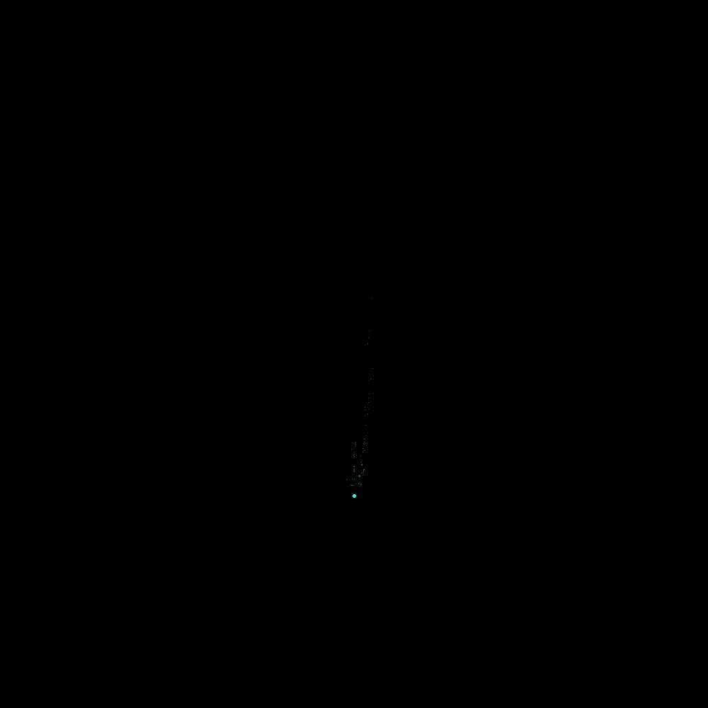

# stereo-vo

C++ Stereo Visual Odometry repository for experimenting with concepts in compute vision.

## Objective
A simple stereo visual odometry pipeline is implemented and tested on the KITTI visual odometry dataset. 

## Method
Here we outline the high level visual odometry strategy.

This is a summary of the calculations performed for each new pair of left and right image.

1. Add new tracking points if the tracked points from the last step are lower than a threshold. [FAST][1] features are detected.
2. Use a [circular matching scheme][2] to match features from left and right and also track them from the previous to current timestep.
3. Triangulate the tracked features based on stereo pairs.
4. The relative pose between times is calculated. The OpenCV PnP with RANSAC is utilized.
5. Finally, the robot pose is calculated based on the previous pose and calulated odometry.

[1]: <https://docs.opencv.org/4.5.2/df/d0c/tutorial_py_fast.html>
[2]: <http://t.cvlibs.net/publications/Geiger2011IV.pdf> "Circular feature matching"

## Installation 
Here is a guide to installing the repository. This was tested with Ubuntu 18.04

### OpenCV
This installation instruction is adapted from the [OpenCV][3] instructions. Tested with OpenCV version 4.5.3.

Install minimal prerequisites

```sudo apt update && sudo apt install -y cmake g++ wget unzip ```

Download and unpack sources
``` 
$ wget -O opencv.zip https://github.com/opencv/opencv/archive/master.zip
wget -O opencv_contrib.zip https://github.com/opencv/opencv_contrib/archive/master.zip
unzip opencv.zip
unzip opencv_contrib.zip
```
Create build directory and switch into it:
 ``` 
 mkdir -p build && cd build
 ```
Configure:
``` 
cmake -DOPENCV_EXTRA_MODULES_PATH= <opencv_contrib>/modules ../opencv-master
```
Build:
``` 
make -j5
```
[3]: <https://docs.opencv.org/4.5.3/d7/d9f/tutorial_linux_install.html>

### KITTI dataset
To run the included test download the [KITTI visual odometry dataset][4] following the instructions on the link and place the dataset in a desired location.

[4]: <http://www.cvlibs.net/datasets/kitti/eval_odometry.php>

### Installation
Currently one needs to manually set the location of the datasets in the source code: edit the path at lines *68* and *93*. Then one can build the project using the following commands starting at the stereo-vo/ path:
```
mkdir build && cd build
cmake ..
make
```
### Demo
To run the demo simply run the executable generated in build:
```
./vo
```

## Sample results



